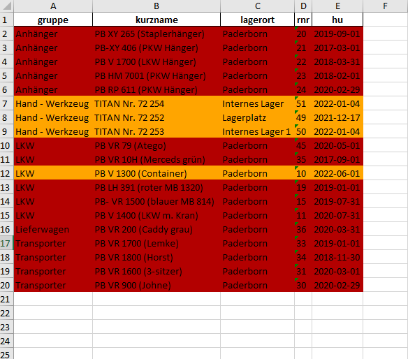
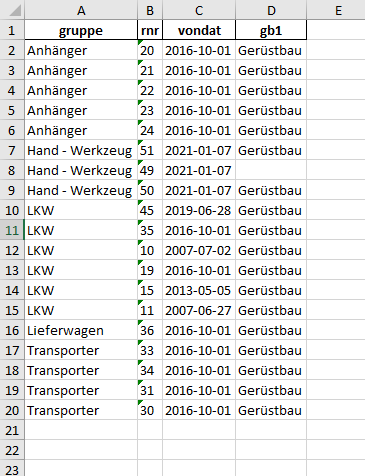

## What Is This?

Implementation of the task from VERO Digital Solutions - https://github.com/VERO-Digital-Solutions/python-task/blob/master/README.md.

## Goal

Download a certain set of resources, merges them with CSV-transmitted resources, and converts them to a formatted excel file.

## How does it work?

- The requirements.txt file should list all Python libraries that program depend on, and they will be installed using:
`pip install -r requirements.txt`
- Run the `main.py` script via Command Line or Terminal by passing parameters:
  - `-k/--keys` arbitrary amount of string arguments, columns to include in the output file (columns `rnr` and `gruppe` will always be included)
  - `-c/--colored` boolean flag, to color each row in the output file depending on the date (`True` by default)

## A Simple Example

`py main.py -k kurzname hu lagerort -c True`

`main.py --keys gb1 vondat --colored False`

